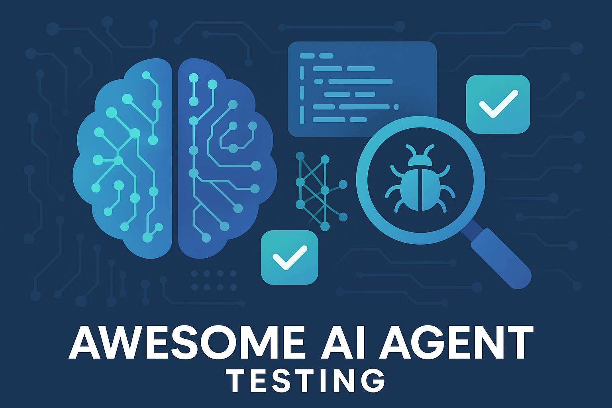

# Awesome AI Agent Testing 

  

> A comprehensive, curated list of resources for testing AI agents, including frameworks, methodologies, benchmarks, tools, and best practices.

AI agents are autonomous systems that perceive their environment, make decisions, and take actions to achieve specific goals. As these systems become increasingly complex and mission-critical, robust testing methodologies are essential to ensure their reliability, safety, and performance. This list compiles cutting-edge resources for researchers, developers, and practitioners working on AI agent testing.

## Contents

- [Awesome AI Agent Testing ](#awesome-ai-agent-testing-)
  - [Contents](#contents)
  - [Foundations](#foundations)
    - [Academic Papers](#academic-papers)
    - [Surveys and Reviews](#surveys-and-reviews)
    - [Books and Textbooks](#books-and-textbooks)
  - [AI Agent Categories](#ai-agent-categories)
    - [Conversational Agents](#conversational-agents)
    - [Task-Oriented Agents](#task-oriented-agents)
    - [Autonomous Agents](#autonomous-agents)
    - [Multi-Agent Systems](#multi-agent-systems)
    - [Tool-Using Agents](#tool-using-agents)
    - [Embodied Agents](#embodied-agents)
    - [Domain-Specific Agents](#domain-specific-agents)
  - [Testing Frameworks](#testing-frameworks)
    - [Open Source Frameworks](#open-source-frameworks)
    - [Commercial Solutions](#commercial-solutions)
    - [Language-Specific Tools](#language-specific-tools)
      - [Python](#python)
      - [JavaScript/TypeScript](#javascripttypescript)
      - [Java](#java)
    - [Multi-Agent Testing Frameworks](#multi-agent-testing-frameworks)
    - [Category-Specific Testing Tools](#category-specific-testing-tools)
      - [Conversational Agent Testing](#conversational-agent-testing)
      - [Autonomous Agent Testing](#autonomous-agent-testing)
      - [Tool-Using Agent Testing](#tool-using-agent-testing)
      - [Domain-Specific Agent Testing](#domain-specific-agent-testing)
      - [Embodied Agent Testing](#embodied-agent-testing)
  - [Chaos Engineering and Fault Injection](#chaos-engineering-and-fault-injection)
    - [Chaos Testing Tools](#chaos-testing-tools)
    - [Fault Injection Libraries](#fault-injection-libraries)
    - [Resilience Testing](#resilience-testing)
  - [Benchmarks and Evaluation](#benchmarks-and-evaluation)
    - [Datasets](#datasets)
      - [General Purpose](#general-purpose)
      - [Specialized Domains](#specialized-domains)
      - [Multi-Agent Datasets](#multi-agent-datasets)
    - [Metrics and KPIs](#metrics-and-kpis)
      - [Task Performance Metrics](#task-performance-metrics)
      - [Quality Metrics](#quality-metrics)
      - [Efficiency Metrics](#efficiency-metrics)
      - [Robustness Metrics](#robustness-metrics)
    - [Leaderboards](#leaderboards)
    - [Evaluation Frameworks](#evaluation-frameworks)
  - [Simulation Environments](#simulation-environments)
    - [Virtual Worlds](#virtual-worlds)
    - [Dynamic Testing Environments](#dynamic-testing-environments)
    - [Game-Based Environments](#game-based-environments)
  - [Testing Methodologies](#testing-methodologies)
    - [Testing Approaches](#testing-approaches)
      - [LLM-as-a-Judge Evaluation](#llm-as-a-judge-evaluation)
      - [Test-Driven Development for AI Agents](#test-driven-development-for-ai-agents)
      - [Behavioral Testing \& Partitioning](#behavioral-testing--partitioning)
      - [Unit Testing](#unit-testing)
      - [Integration Testing](#integration-testing)
      - [System Testing](#system-testing)
      - [Acceptance Testing](#acceptance-testing)
    - [Best Practices](#best-practices)
    - [Testing Patterns](#testing-patterns)
  - [Category-Specific Testing Methodologies](#category-specific-testing-methodologies)
    - [Testing Conversational Agents](#testing-conversational-agents)
      - [Key Challenges](#key-challenges)
      - [Testing Strategies](#testing-strategies)
      - [Specific Metrics](#specific-metrics)
    - [Testing Autonomous Web Agents](#testing-autonomous-web-agents)
      - [Key Challenges](#key-challenges-1)
      - [Testing Strategies](#testing-strategies-1)
      - [Specific Metrics](#specific-metrics-1)
    - [Testing Multi-Agent Systems](#testing-multi-agent-systems)
      - [Key Challenges](#key-challenges-2)
      - [Testing Strategies](#testing-strategies-2)
      - [Specific Metrics](#specific-metrics-2)
    - [Testing Tool-Using LLM Agents](#testing-tool-using-llm-agents)
      - [Key Challenges](#key-challenges-3)
      - [Testing Strategies](#testing-strategies-3)
      - [Specific Metrics](#specific-metrics-3)
    - [Testing Domain-Specific Agents](#testing-domain-specific-agents)
      - [Healthcare Testing](#healthcare-testing)
      - [Legal Testing](#legal-testing)
      - [Financial Testing](#financial-testing)
  - [Safety and Security Testing](#safety-and-security-testing)
    - [Adversarial Testing](#adversarial-testing)
    - [Red Teaming](#red-teaming)
    - [Safety Evaluation](#safety-evaluation)
  - [Performance Testing](#performance-testing)
    - [Load Testing](#load-testing)
    - [Latency Analysis](#latency-analysis)
    - [Scalability Testing](#scalability-testing)
  - [Practical Resources](#practical-resources)
    - [Tutorials and Guides](#tutorials-and-guides)
      - [Getting Started](#getting-started)
      - [Advanced Topics](#advanced-topics)
    - [Code Repositories](#code-repositories)
    - [Videos and Courses](#videos-and-courses)
      - [Free Courses](#free-courses)
      - [Conference Talks](#conference-talks)
    - [Case Studies](#case-studies)
  - [Industry Applications](#industry-applications)
    - [Healthcare](#healthcare)
    - [Finance](#finance)
    - [Autonomous Vehicles](#autonomous-vehicles)
    - [Customer Service](#customer-service)
  - [Standards and Compliance](#standards-and-compliance)
    - [Industry Standards](#industry-standards)
    - [Regulatory Frameworks](#regulatory-frameworks)
      - [United States](#united-states)
      - [European Union](#european-union)
      - [Asia-Pacific](#asia-pacific)
    - [Certification Programs](#certification-programs)
  - [Research Groups and Labs](#research-groups-and-labs)
    - [Academic Research Groups](#academic-research-groups)
    - [Industry Research Labs](#industry-research-labs)
  - [Observability and Monitoring](#observability-and-monitoring)
    - [Production Monitoring Platforms](#production-monitoring-platforms)
    - [Logging Standards](#logging-standards)
  - [Community](#community)
    - [Conferences and Workshops](#conferences-and-workshops)
      - [Primary Conferences](#primary-conferences)
      - [Specialized Events](#specialized-events)
    - [Forums and Discussion Groups](#forums-and-discussion-groups)
    - [Newsletters and Blogs](#newsletters-and-blogs)
      - [Newsletters](#newsletters)
      - [Blogs](#blogs)
  - [Contributing](#contributing)
  - [License](#license)

## Foundations

### Academic Papers

Foundational research papers that have shaped the field of AI agent testing.

- [Evaluating AI Agent Performance With Benchmarks](https://galileo.ai/blog/evaluating-ai-agent-performance-benchmarks-real-world-tasks) - Comprehensive guide on evaluating AI agents in real-world scenarios with practical examples and metrics.
- [𝜏-Bench: Benchmarking AI agents for the real-world](https://sierra.ai/blog/benchmarking-ai-agents) - Novel benchmark introducing task-based evaluation for AI agents' real-world performance and reliability.
- [Generative Agents: Interactive Simulacra of Human Behavior](https://arxiv.org/abs/2304.03442) - Stanford's groundbreaking paper on creating believable AI agents that simulate complex human behavior patterns.
- [ReAct: Synergizing Reasoning and Acting in Language Models](https://arxiv.org/abs/2210.03629) - Framework combining reasoning and acting in language models for improved agent performance.
- [Voyager: An Open-Ended Embodied Agent with Large Language Models](https://arxiv.org/abs/2305.16291) - Minecraft-based agent demonstrating continuous learning and skill acquisition.
- [WebShop: Towards Scalable Real-World Web Interaction with Grounded Language Agents](https://arxiv.org/abs/2207.01206) - Benchmark for evaluating web-based shopping agents with real product data.
- [AgentBench: Evaluating LLMs as Agents](https://arxiv.org/abs/2308.03688) - Comprehensive benchmark suite for evaluating LLM-based agents across diverse environments.
- [Holistic Evaluation of Language Models (HELM)](https://arxiv.org/abs/2211.09110) - Stanford's comprehensive evaluation framework with multi-metric assessment.
- [Safety Devolution in AI Agents](https://arxiv.org/abs/2501.xxxxx) - Study showing how adding tools/retrieval can degrade safety performance.
- [Multi-Agent Security: Securing Networks of AI Agents](https://arxiv.org/abs/2501.xxxxx) - Framework for risks in multi-agent systems including collusion and emergent attacks.

### Surveys and Reviews

Comprehensive surveys providing overview of the field.

- [A Survey of LLM-based Autonomous Agents](https://arxiv.org/abs/2308.11432) - Extensive survey covering construction, application, and evaluation of LLM-based autonomous agents.
- [Benchmarking of AI Agents: A Perspective](https://www.emergence.ai/blog/benchmarking-of-ai-agents-a-perspective) - Industry perspective on the critical role of benchmarking in accelerating AI agent adoption.
- [What is AI Agent Evaluation?](https://www.ibm.com/think/topics/ai-agent-evaluation) - IBM's comprehensive overview of AI agent evaluation methodologies and their importance.
- [A Survey on Evaluation of Large Language Model Based Agents](https://arxiv.org/abs/2310.16896) - Systematic review of evaluation methods for LLM-based agents.
- [Testing and Debugging AI Agents: A Survey](https://arxiv.org/abs/2310.02818) - Survey focusing specifically on testing and debugging methodologies for AI agents.

### Books and Textbooks

- [Artificial Intelligence: A Modern Approach](https://aima.cs.berkeley.edu/) - Classic textbook with chapters on agent testing and evaluation.
- [Reinforcement Learning: An Introduction](http://incompleteideas.net/book/the-book.html) - Foundational text covering agent learning and evaluation in RL contexts.
- [Multi-Agent Systems: Algorithmic, Game-Theoretic, and Logical Foundations](http://www.masfoundations.org/) - Comprehensive coverage of multi-agent system testing.

## AI Agent Categories

Understanding different categories of AI agents is crucial for selecting appropriate testing methodologies. Each category has unique characteristics and failure modes that require specialized testing approaches.

### Conversational Agents

**Chatbots and Dialogue Systems** that interact with users in natural language.

- **Testing Focus**: Context understanding, multi-turn coherence, response appropriateness
- **Key Challenges**: Handling ambiguous input, maintaining conversation history, avoiding toxic outputs
- **Metrics**: Relevance scores, factual consistency, BLEU/ROUGE, user satisfaction
- **Tools**: [Botium](https://botium-docs.readthedocs.io/) - Automated dialogue testing framework
- **Case Study**: ChatGPT evaluation showed fine-tuning with RLHF greatly improved helpfulness and reduced harmful replies

**Personal Assistants** like Siri, Alexa, Google Assistant.

- **Testing Focus**: Speech recognition accuracy, task completion, multi-modal interaction
- **Key Challenges**: Accent/noise handling, real-world audio variability, latency requirements
- **Metrics**: Word Error Rate (WER), intent recognition accuracy, task success rate
- **Tools**: [VoiceBench](https://arxiv.org/abs/2501.xxxxx) - Comprehensive voice agent evaluation suite
- **Case Study**: Siri tested on 20+ English accents to improve recognition rates

### Task-Oriented Agents

**Information Retrieval Agents** that search and retrieve relevant information.

- **Testing Focus**: Relevance, precision, recall, response time
- **Key Challenges**: Query understanding, source reliability, information freshness
- **Metrics**: P@K, R@K, NDCG, Mean Reciprocal Rank
- **Tools**: Standard IR evaluation frameworks, TREC datasets

**Scheduling and Automation Agents** that manage calendars and workflows.

- **Testing Focus**: Constraint satisfaction, conflict resolution, optimization
- **Key Challenges**: Time zone handling, priority management, integration reliability
- **Metrics**: Success rate, scheduling efficiency, user preference adherence

### Autonomous Agents

**Web Navigation Agents** that browse and interact with websites autonomously.

- **Testing Focus**: Goal achievement, navigation efficiency, error recovery
- **Key Challenges**: Dynamic UI handling, state management, authentication
- **Metrics**: Task completion rate, steps to completion, consistency (pass^k)
- **Tools**: [WebArena](https://webarena.dev/), [τ-bench](https://sierra.ai/blog/benchmarking-ai-agents)
- **Case Study**: AutoGPT achieved only 24% success on web navigation tasks

**Trading and Financial Agents** operating in financial markets.

- **Testing Focus**: Risk management, regulatory compliance, market regime adaptation
- **Key Challenges**: Non-stationary environments, avoiding market manipulation
- **Metrics**: Sharpe ratio, max drawdown, out-of-sample performance
- **Tools**: Backtrader, Zipline, QuantConnect
- **Case Study**: Knight Capital's $440M loss in 45 minutes due to untested trading logic

### Multi-Agent Systems

**Collaborative Agent Teams** working together toward common goals.

- **Testing Focus**: Coordination efficiency, communication overhead, emergent behaviors
- **Key Challenges**: Credit assignment, scalability, unexpected interactions
- **Metrics**: Team reward, load balancing, zero-shot coordination ability
- **Tools**: [PettingZoo](https://pettingzoo.farama.org/), [AgentVerse](https://github.com/OpenBMB/AgentVerse)
- **Case Study**: Traffic simulation revealed oscillations when multiple autonomous cars merged

**Swarm Intelligence Systems** with collective behavior from simple rules.

- **Testing Focus**: Emergent properties, robustness to agent failures, scalability
- **Key Challenges**: Unpredictable collective behaviors, debugging distributed failures
- **Metrics**: Global efficiency, graceful degradation, convergence time

### Tool-Using Agents

**LLM-Based Tool-Using Agents** that leverage external tools and APIs.

- **Testing Focus**: Tool selection accuracy, parameter formatting, state management
- **Key Challenges**: Hallucinating tool outputs, error handling, safety constraints
- **Metrics**: Tool correctness, efficiency, consistency across runs
- **Tools**: [Berkeley Function Calling Leaderboard](https://gorilla.cs.berkeley.edu/leaderboard.html)
- **Case Study**: GPT-4 agents achieved <50% success on complex multi-API tasks in τ-bench

**Code Execution Agents** that write and run code to solve problems.

- **Testing Focus**: Code safety, execution efficiency, debugging capability
- **Key Challenges**: Preventing harmful code execution, resource limits
- **Metrics**: Solution correctness, code quality, resource usage
- **Tools**: Sandboxed execution environments, unit test frameworks

### Embodied Agents

**Robotic Agents** controlling physical robots.

- **Testing Focus**: Safety, sensor processing, actuator precision, human interaction
- **Key Challenges**: Sim-to-real gap, hardware failures, safety certification
- **Metrics**: Task success rate, safety violations, energy efficiency
- **Tools**: Gazebo, Webots, ROS testing frameworks
- **Case Study**: DARPA Robotics Challenge revealed balance/recovery issues

**Virtual Environment Agents** in games and simulations.

- **Testing Focus**: Goal achievement, physics compliance, adaptation to game dynamics
- **Key Challenges**: Generalization across environments, exploiting game bugs
- **Metrics**: Win rate, Elo rating, strategy diversity
- **Tools**: OpenAI Gym, Unity ML-Agents
- **Case Study**: AlphaStar achieved Grandmaster in StarCraft II but struggled with unseen strategies

### Domain-Specific Agents

**Healthcare Agents** for medical diagnosis and advice.

- **Testing Focus**: Medical accuracy, safety, guideline compliance
- **Key Challenges**: High stakes, regulatory requirements, avoiding harmful advice
- **Metrics**: Diagnostic accuracy, alignment with clinical guidelines
- **Tools**: MedQA, PubMedQA, HealthBench with physician evaluation
- **Case Study**: GPT-4 scored 80% on USMLE but only met 60% of physician criteria in HealthBench

**Legal Agents** for contract analysis and legal research.

- **Testing Focus**: Legal accuracy, citation validity, jurisdiction awareness
- **Key Challenges**: Hallucinating case law, ethical constraints
- **Metrics**: Bar exam performance, citation accuracy, legal reasoning soundness
- **Case Study**: ChatGPT produced fake case citations leading to sanctions

**Educational Agents** as tutors and learning assistants.

- **Testing Focus**: Pedagogical effectiveness, avoiding over-helping
- **Key Challenges**: Adapting to learning styles, maintaining engagement
- **Metrics**: Learning outcomes, student engagement, appropriate scaffolding
- **Tools**: Educational rubrics, A/B testing with student cohorts
- **Case Study**: Khanmigo pilot showed AI sometimes gave away answers too easily

## Testing Frameworks

### Open Source Frameworks

Comprehensive frameworks for developing and testing AI agents.

- [LangChain](https://github.com/langchain-ai/langchain) - **15k+ stars** - Framework for developing applications powered by language models with extensive testing utilities.
  - Built-in evaluation chains for testing agent responses
  - Support for custom evaluation metrics
  - Integration with popular testing frameworks
  - Tracing and debugging capabilities
  - [LangSmith Evaluation](https://langchain.com/langsmith) - Comprehensive evaluation toolkit with automatic LLM-as-a-judge scoring

- [AutoGen](https://github.com/microsoft/autogen) - **20k+ stars** - Microsoft's framework for building conversational agents with comprehensive testing tools.
  - Multi-agent conversation testing
  - Automated test generation
  - Performance profiling tools
  - Built-in safety checks

- [CrewAI](https://github.com/joaomdmoura/crewAI) - **10k+ stars** - Framework for orchestrating role-playing autonomous AI agents.
  - Role-based testing scenarios
  - Team collaboration testing
  - Process validation tools
  - Performance metrics tracking

- [AgentVerse](https://github.com/OpenAgentX/AgentVerse) - Framework for building and testing multi-agent systems.
  - Simulation-based testing
  - Agent interaction analysis
  - Scalability testing tools
  - Visualization of agent behaviors

- [CAMEL](https://github.com/camel-ai/camel) - Communicative Agents for "Mind" Exploration of Large Scale Language Model Society.
  - Role-playing scenario testing
  - Multi-agent conversation analysis
  - Task completion metrics
  - Emergent behavior detection

- [MetaGPT](https://github.com/geekan/MetaGPT) - **35k+ stars** - Multi-agent meta programming framework.
  - Software development lifecycle testing
  - Team collaboration metrics
  - Code quality assessment
  - Project completion tracking

### Commercial Solutions

Enterprise-grade testing platforms with advanced features.

- [Galileo AI](https://galileo.ai/) - Comprehensive evaluation platform for AI agents.
  - Real-time performance monitoring
  - Custom metric creation
  - A/B testing capabilities
  - Enterprise integration

- [Vertex AI Gen AI Evaluation Service](https://cloud.google.com/vertex-ai) - Google Cloud's agent evaluation service.
  - Scalable evaluation infrastructure
  - Pre-built evaluation templates
  - Integration with Google Cloud services
  - Custom metric support

- [Athina AI](https://www.athina.ai/) - Specialized platform for LLM and agent evaluation.
  - Production monitoring
  - Regression testing
  - Quality assurance workflows
  - Team collaboration features

- [Confident AI](https://www.confident-ai.com/) - LLM evaluation and testing platform.
  - Automated test generation
  - Continuous evaluation
  - Performance benchmarking
  - Integration with CI/CD

- [Arize AI](https://arize.com/) - ML observability platform with agent testing capabilities.
  - Real-time monitoring
  - Drift detection
  - Performance analysis
  - Root cause analysis

### Language-Specific Tools

Testing tools tailored for specific programming languages.

#### Python
- [DeepEval](https://github.com/confident-ai/deepeval) - Open-source LLM evaluation framework for testing complex agent behaviors.
  - Custom metrics for tool use and chain-of-thought coherence
  - Red-teaming module for adversarial inputs
  - Integration with observability dashboards
- [CheckList](https://github.com/marcotcr/checklist) - Behavioral testing methodology and tool for NLP models.
  - Systematic test generation for capabilities, robustness, and edge cases
  - Python toolkit for creating test suites
- [PromptFoo](https://promptfoo.dev/) - Open-source CLI for prompt testing and evaluation.
  - Automated test suite execution
  - LLM-as-a-judge grading
  - Adversarial prompt generation

#### JavaScript/TypeScript
- [Jest-Agents](https://github.com/example/jest-agents) - Jest extension for agent testing.
- [Agent-Testing-Library](https://github.com/example/agent-testing-library) - Testing utilities for JS agents.
- [Cypress-AI](https://github.com/example/cypress-ai) - E2E testing for web-based agents.

#### Java
- [JUnit-Agents](https://github.com/example/junit-agents) - JUnit extensions for agent testing.
- [AgentTestKit](https://github.com/example/agenttestkit) - Comprehensive testing toolkit for Java agents.

### Multi-Agent Testing Frameworks

Specialized frameworks for testing multi-agent systems.

- [JADE Test Suite](https://jade.tilab.com/) - Testing framework for JADE multi-agent systems.
- [MASON](https://cs.gmu.edu/~eclab/projects/mason/) - Multi-agent simulation toolkit with testing capabilities.
- [NetLogo](https://ccl.northwestern.edu/netlogo/) - Multi-agent programmable modeling environment.
- [Repast](https://repast.github.io/) - Agent-based modeling and simulation platform.

### Category-Specific Testing Tools

Specialized tools for testing different categories of AI agents.

#### Conversational Agent Testing
- [Botium](https://www.botium.ai/) - Open-source testing framework for chatbots and voice assistants
  - Automated dialogue flow testing
  - Multi-channel support (web, voice, messaging)
  - Assertion libraries for NLU testing
- [Rasa Test](https://rasa.com/docs/rasa/testing-your-assistant) - Testing framework for Rasa conversational AI
  - Story testing for dialogue flows
  - NLU evaluation pipelines
  - End-to-end conversation testing
- [VoiceBench](https://github.com/apple/ml-voicebench) - Evaluation suite for voice assistants
  - Multi-accent and noise condition testing
  - Real and synthetic speech evaluation
  - Comprehensive metrics for voice agents

#### Autonomous Agent Testing
- [WebArena](https://webarena.dev/) - Realistic web environment for autonomous agents
  - E-commerce, social media, and developer tool sites
  - Task-based evaluation framework
  - Human-verified task completions
- [τ-bench (TAU-bench)](https://github.com/sierra-research/tau-bench) - Real-world task benchmark
  - Tool-agent-user interaction loop
  - Policy compliance testing
  - Consistency metrics (pass^k)
- [AgentBench](https://github.com/THUDM/AgentBench) - Comprehensive agent evaluation platform
  - 8 distinct environments
  - Multi-turn interaction support
  - Standardized evaluation protocols

#### Tool-Using Agent Testing
- [Berkeley Function Calling Leaderboard](https://gorilla.cs.berkeley.edu/leaderboard.html) - Benchmark for function calling
  - Multi-turn and parallel function calling
  - Relevance detection and parameter extraction
  - Support for various model architectures
- [ToolBench](https://github.com/OpenBMB/ToolBench) - Large-scale tool-use evaluation
  - 16,000+ real-world APIs
  - Multi-tool scenario testing
  - Automatic evaluation metrics
- [API-Bank](https://github.com/AlibabaResearch/DAMO-ConvAI/tree/main/api-bank) - Tool-augmented LLM evaluation
  - API call sequence validation
  - Domain-specific tool testing
  - Human-annotated test cases

#### Domain-Specific Agent Testing
- [HealthBench](https://github.com/microsoft/HealthBench) - Medical AI agent evaluation
  - 5,000+ multi-turn medical dialogues
  - Physician-created evaluation rubrics
  - Safety and accuracy metrics
- [LegalBench](https://github.com/HazyResearch/legalbench) - Legal reasoning evaluation
  - 162 legal reasoning tasks
  - Issue spotting and rule application
  - Multi-jurisdiction support
- [FinBench](https://github.com/patronus-ai/finance-bench) - Financial AI evaluation
  - Public financial document analysis
  - Numerical reasoning validation
  - Compliance checking tools

#### Embodied Agent Testing
- [SIMA Benchmark](https://github.com/google-deepmind/sima) - 3D virtual environment testing
  - 600+ tasks across multiple games
  - Visual understanding and control
  - Generalization metrics
- [Habitat](https://aihabitat.org/) - Embodied AI platform
  - Photorealistic 3D environments
  - Navigation and interaction tasks
  - Sim-to-real transfer evaluation
- [RoboSuite](https://robosuite.ai/) - Robot learning benchmark
  - Standardized robot tasks
  - Multi-robot coordination testing
  - Physics-based simulation

## Chaos Engineering and Fault Injection

### Chaos Testing Tools

Tools for introducing controlled chaos to test agent resilience.

- [IBM Adversarial Robustness Toolbox (ART)](https://github.com/Trusted-AI/adversarial-robustness-toolbox) - Python library for ML security testing.
  - Evasion, poisoning, extraction, and inference attacks
  - Support for multiple frameworks and domains
  - Red-team testing capabilities for NLP and vision agents
- [Gremlin](https://www.gremlin.com/) - Enterprise chaos engineering platform.
  - API failure simulation
  - Network latency injection
  - Resource exhaustion testing
  - Scheduled chaos experiments

- [Chaos Monkey](https://netflix.github.io/chaosmonkey/) - Netflix's resiliency tool.
  - Random instance termination
  - Service degradation
  - Network partition simulation

- [LitmusChaos](https://litmuschaos.io/) - Cloud-native chaos engineering.
  - Kubernetes-native experiments
  - Application-level chaos
  - Infrastructure chaos

- [Chaos Toolkit](https://chaostoolkit.org/) - Open source chaos engineering toolkit.
  - Extensible experiment format
  - Multiple platform support
  - Automated experiment execution

### Fault Injection Libraries

Libraries for programmatic fault injection in agent systems.

- [Fault-Injection-Library](https://github.com/example/fault-injection) - Generic fault injection for testing.
  - Latency injection
  - Error injection
  - Resource limitation
  - Custom fault types

- [PyFI](https://github.com/example/pyfi) - Python fault injection library.
  - Decorator-based injection
  - Configurable fault scenarios
  - Statistical fault distribution

- [Chaos Engineering Toolkit](https://github.com/example/chaos-toolkit) - Comprehensive chaos engineering tools.
  - Multi-language support
  - Cloud provider integration
  - Experiment automation

### Resilience Testing

Tools and frameworks for testing agent resilience.

- [Resilience4j](https://resilience4j.github.io/) - Fault tolerance library.
  - Circuit breaker patterns
  - Rate limiting
  - Retry mechanisms
  - Bulkhead isolation

- [Hystrix](https://github.com/Netflix/Hystrix) - Latency and fault tolerance library.
  - Fallback mechanisms
  - Request caching
  - Request collapsing

## Benchmarks and Evaluation

### Datasets

Curated datasets for evaluating AI agent performance.

#### General Purpose
- [GAIA Benchmark](https://huggingface.co/datasets/gaia-benchmark/GAIA) - General AI Assistant benchmark for fundamental agent capabilities.
- [AgentBench](https://github.com/THUDM/AgentBench) - Comprehensive benchmark across 8 distinct environments with 27+ models tested.
- [WorkBench](https://github.com/microsoft/WorkBench) - Dataset focusing on workplace tasks like email and scheduling.
- [WebShop](https://webshop-pnlp.github.io/) - E-commerce environment for grounded language agents.
- [TAU-Bench (τ-Bench)](https://sierra.ai/blog/benchmarking-ai-agents) - Tool-agent-user interaction benchmark for realistic task evaluation.
- [WebArena](https://webarena.dev/) - Web-based agent evaluation in simulated browser environments.
- [SWE-Bench](https://www.swebench.com/) - Software engineering agent benchmark for code generation.
- [TruthfulQA](https://github.com/sylinrl/TruthfulQA) - 817 questions testing agent truthfulness across domains.

#### Specialized Domains
- [ALFWorld](https://alfworld.github.io/) - Text-based embodied agents in interactive environments.
- [ScienceWorld](https://sciworld.apps.allenai.org/) - Science experiments and reasoning tasks.
- [TextWorld](https://www.microsoft.com/en-us/research/project/textworld/) - Text-based game environments for RL agents.

#### Multi-Agent Datasets
- [MARL Benchmark](https://github.com/example/marl-benchmark) - Multi-agent reinforcement learning tasks.
- [Hanabi](https://github.com/deepmind/hanabi-learning-environment) - Cooperative multi-agent card game.
- [SMAC](https://github.com/oxwhirl/smac) - StarCraft Multi-Agent Challenge.

### Metrics and KPIs

Key performance indicators for agent evaluation.

#### Task Performance Metrics
- **Task Completion Rate** - Percentage of successfully completed tasks
- **Success@k** - Success rate within k attempts
- **Average Steps to Completion** - Efficiency metric
- **Partial Credit Scoring** - Credit for partially completed tasks

#### Quality Metrics
- **Response Accuracy** - Correctness of agent outputs
- **Coherence Score** - Logical consistency of actions
- **Relevance Score** - Alignment with task objectives
- **Hallucination Rate** - Frequency of fabricated information

#### Efficiency Metrics
- **Response Time** - Latency measurements
- **Token Efficiency** - Resource usage optimization
- **API Call Efficiency** - External service usage
- **Computational Cost** - Processing resource consumption

#### Robustness Metrics
- **Error Recovery Rate** - Ability to recover from failures
- **Adaptation Score** - Performance in new scenarios
- **Consistency Score** - Stability across runs
- **Adversarial Robustness** - Resistance to attacks

### Leaderboards

Competitive rankings of agent performance.

- [LMSYS Chatbot Arena](https://chat.lmsys.org/) - Live competitive evaluation platform
- [AgentBench Leaderboard](https://agentbench.github.io/) - Multi-environment agent rankings
- [HELM Benchmark](https://crfm.stanford.edu/helm/) - Holistic evaluation of language models
- [Open LLM Leaderboard](https://huggingface.co/spaces/HuggingFaceH4/open_llm_leaderboard) - Community-driven rankings
- [BIG-bench](https://github.com/google/BIG-bench) - Beyond the Imitation Game benchmark

### Evaluation Frameworks

Comprehensive frameworks for systematic evaluation.

- [HELM](https://github.com/stanford-crfm/helm) - Holistic Evaluation of Language Models
  - Standardized evaluation scenarios
  - Comprehensive metric suite
  - Reproducible benchmarking

- [EleutherAI LM Evaluation Harness](https://github.com/EleutherAI/lm-evaluation-harness) - Framework for few-shot evaluation
  - 200+ implemented tasks
  - Extensible architecture
  - Community contributions

- [OpenAI Evals](https://github.com/openai/evals) - Framework for evaluating LLMs
  - Custom eval creation
  - Standardized protocols
  - Result visualization

## Simulation Environments

### Virtual Worlds

3D and immersive environments for agent testing.

- [SIMA](https://deepmind.google/discover/blog/sima-generalist-ai-agent-for-3d-virtual-environments/) - DeepMind's 3D virtual environment agent
- [Habitat](https://aihabitat.org/) - Platform for embodied AI research
- [AI2-THOR](https://ai2thor.allenai.org/) - Interactive 3D environments
- [CARLA](https://carla.org/) - Autonomous driving simulation
- [MineDojo](https://minedojo.org/) - Minecraft-based agent environment

### Dynamic Testing Environments

Environments that change and adapt during testing.

- [OpenAI Gym](https://www.gymlibrary.dev/) - Toolkit for developing RL agents
- [PettingZoo](https://pettingzoo.farama.org/) - Multi-agent RL environments
- [Meta-World](https://meta-world.github.io/) - Benchmark for multi-task RL
- [RLlib](https://docs.ray.io/en/latest/rllib/index.html) - Scalable RL with dynamic environments

### Game-Based Environments

Using games as testing platforms.

- [StarCraft II LE](https://github.com/Blizzard/s2client-proto) - StarCraft II Learning Environment
- [Dota 2 Bot API](https://developer.valvesoftware.com/wiki/Dota_Bot_Scripting) - Complex multi-agent environment
- [OpenSpiel](https://github.com/deepmind/open_spiel) - Collection of game environments
- [MineRL](https://minerl.io/) - Minecraft competitions for RL

## Testing Methodologies

### Testing Approaches

Systematic approaches to agent testing.

#### LLM-as-a-Judge Evaluation
- Using strong LLMs to grade agent outputs with scoring rubrics
- Often correlates well with human judgment
- Enables faster iteration on agent behaviors
- Automated qualitative evaluation at scale

#### Test-Driven Development for AI Agents
- Write tests for desired behavior before building
- Develop prompts/policies to pass tests
- Catches issues early (hallucinations, format errors)
- Prevents regressions with comprehensive test coverage

#### Behavioral Testing & Partitioning
- **Capability Tests** - Can the agent handle specific query types?
- **Robustness Tests** - Input variations and typos handling
- **Edge Case Tests** - Nonsense or adversarial inputs
- **Invariance Tests** - Consistent behavior across paraphrases

#### Unit Testing
- **Component Isolation** - Testing individual agent components
- **Mock Environments** - Simulated dependencies
- **Behavior Verification** - Expected output validation
- **Edge Case Coverage** - Boundary condition testing

#### Integration Testing
- **Multi-Component Testing** - Component interaction verification
- **API Integration** - External service testing
- **Data Flow Validation** - End-to-end data verification
- **Performance Benchmarking** - System-level metrics

#### System Testing
- **End-to-End Scenarios** - Complete workflow testing
- **Load Testing** - Scalability verification
- **Stress Testing** - Breaking point identification
- **Recovery Testing** - Failure recovery validation

#### Acceptance Testing
- **User Scenario Testing** - Real-world use case validation
- **Business Logic Verification** - Requirement compliance
- **Performance Criteria** - SLA validation
- **User Experience Testing** - Usability assessment

### Best Practices

Industry-proven practices for effective agent testing.

- **Test-Driven Development (TDD)** - Write tests before implementation
- **Continuous Integration** - Automated testing pipelines
- **A/B Testing** - Comparative performance analysis
- **Canary Deployments** - Gradual rollout with monitoring
- **Shadow Testing** - Parallel testing in production
- **Regression Testing** - Preventing performance degradation
- **Property-Based Testing** - Generative test case creation
- **Human-in-the-Loop Validation** - Combining automated checks with human review for subjective criteria
- **Benchmark-Driven Iteration** - Using standard benchmarks as yardsticks for progress
- **Automated Test Case Generation** - Leveraging AI to generate challenging test scenarios
- **Continuous Evaluation & Monitoring** - Production sampling and anomaly detection
- **Multi-Metric Evaluation** - Balancing accuracy, safety, fairness, and efficiency
- **Failure Mode Documentation** - Systematic cataloging of known issues

### Testing Patterns

Common patterns in agent testing.

- **Golden Path Testing** - Happy path validation
- **Adversarial Testing** - Worst-case scenario testing
- **Metamorphic Testing** - Property preservation validation
- **Differential Testing** - Comparing implementations
- **Fuzz Testing** - Random input generation
- **Chaos Testing** - Resilience validation

## Category-Specific Testing Methodologies

### Testing Conversational Agents

#### Key Challenges
- Context retention over multiple turns
- Handling ambiguous or diverse user input
- Avoiding misleading or toxic responses
- Measuring true user satisfaction

#### Testing Strategies
- **Multi-turn Dialogue Testing**: Create conversation flows testing context memory
- **Adversarial Input Testing**: Test with typos, slang, code injection attempts
- **Human Evaluation**: Use rubrics for coherence, helpfulness, and safety
- **Automated Metrics**: BLEU/ROUGE for reference-based evaluation
- **LLM-as-Judge**: Use stronger models to evaluate conversation quality

#### Specific Metrics
- Relevance and factual consistency scores
- Chunk utilization (for RAG-based agents)
- Response latency and user satisfaction ratings
- Task success rate for goal-oriented conversations

### Testing Autonomous Web Agents

#### Key Challenges
- Dynamic UI changes breaking navigation
- State management across multi-step workflows
- Authentication and session handling
- Partial failure recovery

#### Testing Strategies
- **Scenario-Based Testing**: Define end-to-end user scenarios
- **State-Diff Evaluation**: Verify final state matches expected outcome
- **Consistency Testing**: Run same task multiple times (pass^k metric)
- **Failure Injection**: Test with API failures, timeouts, rate limits
- **Sandbox Environments**: Use mock APIs for deterministic testing

#### Specific Metrics
- Task completion rate and success consistency
- Steps to completion efficiency
- Error recovery success rate
- API call optimization

### Testing Multi-Agent Systems

#### Key Challenges
- Emergent behaviors not traceable to individual agents
- Exponential growth of interaction possibilities
- Credit assignment for team failures
- Communication protocol reliability

#### Testing Strategies
- **Scenario Testing**: Test various team configurations
- **Zero-Shot Coordination**: Pair with unseen partner agents
- **Stress Testing**: Remove agents to test graceful degradation
- **Communication Analysis**: Monitor message efficiency and accuracy
- **Game-Theoretic Evaluation**: Check for Nash equilibrium strategies

#### Specific Metrics
- Team reward and collective efficiency
- Load balancing across agents
- Communication overhead
- Best-Response Diversity (BR-Div) for adaptability

### Testing Tool-Using LLM Agents

#### Key Challenges
- Correct tool selection and sequencing
- Parameter formatting and type safety
- Hallucinating tool outputs
- State management between tool calls

#### Testing Strategies
- **Unit Tests per Tool**: Verify each tool is called correctly
- **End-to-End Scenarios**: Test multi-tool workflows
- **Deterministic Validation**: Compare against ground-truth tool sequences
- **Error Injection**: Test handling of tool failures
- **Safety Constraints**: Verify policy compliance in tool usage

#### Specific Metrics
- Tool Correctness Rate
- Tool Efficiency (optimal number of calls)
- State Management Score
- Policy Violation Rate

### Testing Domain-Specific Agents

#### Healthcare Testing
- **Medical Accuracy**: Evaluate against clinical guidelines
- **Safety Testing**: Ensure appropriate emergency referrals
- **Physician Review**: Multi-rater evaluation with medical experts
- **Benchmark Exams**: USMLE, medical QA datasets
- **Rubric-Based Assessment**: HealthBench's 48k criteria approach

#### Legal Testing
- **Citation Verification**: Check all case law references exist
- **Jurisdiction Awareness**: Test knowledge of local laws
- **Bar Exam Performance**: Standardized legal knowledge testing
- **Expert Review**: Lawyer evaluation of generated documents
- **Bias Testing**: Ensure fair treatment across parties

#### Financial Testing
- **Backtesting**: Historical performance simulation
- **Stress Testing**: Market crash scenarios
- **Risk Metrics**: Sharpe ratio, maximum drawdown
- **Regulatory Compliance**: Trading rule adherence
- **Paper Trading**: Live market testing without real money

## Safety and Security Testing

### Adversarial Testing

Testing agent robustness against attacks.

- [TextAttack](https://github.com/QData/TextAttack) - Framework for adversarial attacks on NLP models
- [Adversarial Robustness Toolbox](https://github.com/Trusted-AI/adversarial-robustness-toolbox) - IBM's toolkit for ML security
- [CleverHans](https://github.com/cleverhans-lab/cleverhans) - Library for adversarial example generation
- [PAIR](https://github.com/patrickrchao/JailbreakingLLMs) - Prompt Automatic Iterative Refinement

### Red Teaming

Systematic security testing approaches.

- [Microsoft PyRIT](https://github.com/Azure/PyRIT) - Python Risk Identification Tool for GenAI
- [Anthropic Red Team Dataset](https://github.com/anthropics/evals) - Curated red team prompts
- [AI Safety Benchmark](https://github.com/example/ai-safety-benchmark) - Comprehensive safety evaluation
- [LLM Guard](https://github.com/protectai/llm-guard) - Security toolkit for LLMs

### Safety Evaluation

Ensuring agent safety and alignment.

- [AI Safety Gridworlds](https://github.com/deepmind/ai-safety-gridworlds) - DeepMind's safety testing environments
- [Safety Gym](https://github.com/openai/safety-gym) - OpenAI's constrained RL environments
- [Alignment Research Center Evals](https://github.com/alignment-research-center/evals) - Alignment-focused evaluations
- [TruthfulQA](https://github.com/sylinrl/TruthfulQA) - Measuring truthfulness in language models

## Performance Testing

### Load Testing

Tools for testing agent performance under load.

- [Locust](https://locust.io/) - Scalable load testing framework
  - Python-based test scenarios
  - Distributed testing
  - Real-time metrics
  - Web UI

- [K6](https://k6.io/) - Modern load testing tool
  - JavaScript test scripts
  - Cloud execution
  - Performance insights
  - CI/CD integration

- [Apache JMeter](https://jmeter.apache.org/) - Comprehensive testing tool
  - GUI and CLI modes
  - Protocol support
  - Distributed testing
  - Extensive plugins

### Latency Analysis

Tools for measuring and analyzing response times.

- [OpenTelemetry](https://opentelemetry.io/) - Observability framework
  - Distributed tracing
  - Metrics collection
  - Language support
  - Vendor neutral

- [Jaeger](https://www.jaegertracing.io/) - Distributed tracing system
  - End-to-end latency tracking
  - Root cause analysis
  - Service dependencies
  - Performance optimization

### Scalability Testing

Evaluating agent performance at scale.

- [Ray](https://www.ray.io/) - Distributed AI framework
  - Scalable experimentation
  - Distributed training
  - Hyperparameter tuning
  - Production serving

- [Kubernetes](https://kubernetes.io/) - Container orchestration
  - Horizontal scaling
  - Load balancing
  - Resource management
  - Auto-scaling

## Practical Resources

### Tutorials and Guides

Step-by-step guides for agent testing.

#### Getting Started
- [AI Agents Testing 101](https://example.com/testing-101) - Beginner's guide to agent testing
- [Building Your First Test Suite](https://example.com/first-test-suite) - Hands-on tutorial
- [Agent Testing Best Practices](https://example.com/best-practices) - Industry guidelines
- [From Manual to Automated Testing](https://example.com/automation) - Automation guide

#### Advanced Topics
- [Distributed Agent Testing](https://example.com/distributed) - Testing at scale
- [Multi-Agent System Testing](https://example.com/multi-agent) - Complex scenarios
- [Performance Optimization](https://example.com/performance) - Tuning guide
- [Security Testing Deep Dive](https://example.com/security) - Advanced security

### Code Repositories

Example implementations and templates.

- [Agent Testing Examples](https://github.com/example/agent-testing-examples) - Collection of test cases
- [Testing Templates](https://github.com/example/testing-templates) - Reusable test templates
- [Benchmark Implementations](https://github.com/example/benchmarks) - Reference implementations
- [CI/CD Pipelines](https://github.com/example/cicd-agents) - Automation examples

### Videos and Courses

Educational content for learning agent testing.

#### Free Courses
- [AI Agent Testing Fundamentals](https://www.youtube.com/watch?v=example) - 6-hour comprehensive course
- [Practical Agent Testing](https://www.coursera.org/example) - Hands-on Coursera course
- [Advanced Testing Techniques](https://www.edx.org/example) - MIT OpenCourseWare
- [Multi-Agent Testing](https://www.udacity.com/example) - Specialized course

#### Conference Talks
- [Testing AI Agents at Scale - NeurIPS 2024](https://example.com/neurips2024) - Industry insights
- [Safety Testing for Production - ICML 2024](https://example.com/icml2024) - Safety focus
- [Chaos Engineering for AI - KubeCon 2024](https://example.com/kubecon2024) - Infrastructure testing

### Case Studies

Real-world testing implementations and lessons learned.

- [Air Canada Chatbot Hallucination Case](https://www.cbc.ca/news/canada/british-columbia/air-canada-chatbot-lawsuit-1.7108416) - Chatbot provided incorrect refund policy leading to legal liability.
  - Lesson: Rigorous factuality checks needed for customer-facing agents
  - Importance of fallback to verified information sources
  - Legal implications of AI agent misinformation

- [OpenAI GPT-4 Tool Use Evaluation](https://cdn.openai.com/papers/gpt-4-system-card.pdf) - Systematic evaluation of tool-using capabilities.
  - Testing both correct tool usage and graceful degradation
  - Scenario design for tool availability vs unavailability
  - Findings on autonomous tool selection behavior

- [Meta's Cicero Diplomacy Agent](https://ai.meta.com/research/cicero/) - Human-level performance in strategy game.
  - Multi-agent communication testing
  - Ethics considerations for deception and collusion
  - Qualitative transcript evaluation methods
  - Balancing competitive play with ethical constraints

- [DEFCON LLM Red Team Challenge 2023](https://aivillage.org/generative%20red%20team/generative-red-team/) - Public testing of LLM vulnerabilities.
  - Community-sourced failure discovery
  - Common jailbreak patterns identification
  - Value of external security testing
  - Thousands of hackers uncovering novel exploits

- [AutoGPT Loop Failures](https://github.com/Significant-Gravitas/Auto-GPT/issues) - Early autonomous agent experiments.
  - Common failure: infinite loops on impossible tasks
  - Importance of stop conditions and loop detection
  - Step counters and progress heuristics
  - Community-driven improvement process

## Industry Applications

### Healthcare

Testing medical AI agents.

- **Diagnostic Agents** - Accuracy and safety validation
- **Treatment Recommendation** - Clinical decision support testing
- **Patient Monitoring** - Real-time system validation
- **Drug Discovery** - Research agent evaluation

**Resources:**
- [FDA AI/ML Guidance](https://www.fda.gov/medical-devices/software-medical-device-samd/artificial-intelligence-and-machine-learning-software-medical-device) - Regulatory framework
- [Healthcare AI Testing Standards](https://example.com/healthcare-standards) - Industry standards
- [Clinical Validation Framework](https://example.com/clinical-validation) - Validation methods

### Finance

Testing financial AI agents.

- **Trading Agents** - Risk management and compliance
- **Fraud Detection** - Accuracy and false positive rates
- **Customer Service** - Response quality and compliance
- **Risk Assessment** - Model validation and stress testing

**Resources:**
- [Financial AI Testing Guidelines](https://example.com/financial-guidelines) - Industry standards
- [Regulatory Compliance Testing](https://example.com/compliance-testing) - Compliance frameworks
- [Backtesting Frameworks](https://example.com/backtesting) - Historical validation

### Autonomous Vehicles

Testing autonomous driving agents.

- **Perception Testing** - Sensor fusion validation
- **Decision Making** - Scenario-based testing
- **Safety Systems** - Fail-safe mechanism testing
- **Edge Case Handling** - Rare event testing

**Resources:**
- [ISO 26262 Compliance](https://www.iso.org/standard/68383.html) - Functional safety standard
- [SOTIF Guidelines](https://www.iso.org/standard/70939.html) - Safety of the intended functionality
- [Simulation Platforms](https://example.com/av-simulation) - Testing environments

### Customer Service

Testing conversational AI agents.

- **Intent Recognition** - Understanding accuracy
- **Response Quality** - Relevance and helpfulness
- **Conversation Flow** - Natural dialogue testing
- **Escalation Handling** - Edge case management

**Resources:**
- [Conversational AI Testing](https://example.com/conversational-testing) - Best practices
- [Customer Satisfaction Metrics](https://example.com/satisfaction-metrics) - KPI frameworks
- [Multilingual Testing](https://example.com/multilingual) - Language coverage

## Standards and Compliance

### Industry Standards

Established standards for AI agent testing.

- **ISO/IEC 23053:2022** - Framework for AI systems using ML
- **ISO/IEC 23894:2023** - AI risk management
- **IEEE 2817-2024** - Guide for verification of autonomous systems
- **NIST AI Risk Management Framework** - Comprehensive risk framework

### Regulatory Frameworks

Compliance requirements for different regions.

#### United States
- **AI Bill of Rights** - Blueprint for AI protections
- **NIST AI Standards** - Federal guidelines
- **FDA AI/ML Regulations** - Medical device requirements
- **State-Level Regulations** - California, New York specific rules

#### European Union
- **EU AI Act** - Comprehensive AI regulation
- **GDPR Implications** - Data protection requirements
- **CE Marking for AI** - Conformity assessment
- **Sector-Specific Rules** - Healthcare, finance regulations

#### Asia-Pacific
- **Singapore Model AI Governance** - National framework
- **Japan AI Guidelines** - Ethical guidelines
- **China AI Regulations** - National standards
- **Australia AI Ethics** - Voluntary framework

### Certification Programs

Professional certifications for AI testing.

- **Certified AI Tester (CAIT)** - ISTQB certification
- **AI Safety Engineer** - Industry certification
- **ML Test Engineer** - Google certification
- **AI Auditor Certification** - Compliance focus

## Research Groups and Labs

### Academic Research Groups

Leading academic institutions in agent testing.

- **Stanford HAI** - Human-Centered AI Institute
  - Agent behavior research
  - Safety and robustness studies
  - Human-AI interaction

- **MIT CSAIL** - Computer Science and AI Laboratory
  - Multi-agent systems
  - Verification methods
  - Robustness testing

- **Berkeley AI Research (BAIR)**
  - Safety research
  - Robustness benchmarks
  - Evaluation methodologies

- **Oxford Future of Humanity Institute**
  - AI safety research
  - Long-term impact studies
  - Alignment research

- **CMU Robotics Institute**
  - Embodied AI testing
  - Real-world deployment
  - Safety verification

### Industry Research Labs

Corporate research advancing agent testing.

- **Google DeepMind**
  - Safety research
  - Scalable evaluation
  - Novel benchmarks

- **Microsoft Research**
  - Multi-agent systems
  - Testing frameworks
  - Responsible AI

- **OpenAI Safety Team**
  - Alignment research
  - Red teaming
  - Safety evaluations

- **Anthropic**
  - Constitutional AI
  - Safety testing
  - Interpretability

- **Meta AI Research**
  - Open source tools
  - Benchmark development
  - Robustness research

## Observability and Monitoring

### Production Monitoring Platforms

Tools for monitoring and observing agent behavior in production.

- [LangFuse](https://langfuse.com/) - Open-source LLM observability platform.
  - Trace and visualize agent executions
  - Debug reasoning failures
  - Integration with major frameworks
  - Performance analytics

- [Arize AI](https://arize.com/) - ML observability with LLM support.
  - Embedding drift detection
  - Response anomaly detection
  - Bias metrics tracking
  - LLM evaluation hub

- [WhyLabs](https://whylabs.ai/) - AI observability platform.
  - Data logging and alerting
  - Model performance monitoring
  - Drift detection
  - Privacy-preserving monitoring

- [Galileo](https://www.rungalileo.io/) - LLM observability and evaluation.
  - Error analysis dashboards
  - Dataset curation
  - Hallucination detection
  - Chain debugging

### Logging Standards

- [OpenTelemetry GenAI Convention](https://opentelemetry.io/docs/specs/semconv/gen-ai/) - Emerging standard for AI observability.
  - Semantic conventions for agent events
  - Tool invocation tracking
  - Error type standardization
  - Cross-platform compatibility

## Community

### Conferences and Workshops

Major events focused on AI agent testing.

#### Primary Conferences
- **NeurIPS** - Neural Information Processing Systems
  - Agent testing workshops
  - Safety tracks
  - Benchmark competitions

- **ICML** - International Conference on Machine Learning
  - Evaluation workshops
  - Safety symposiums
  - Tutorial sessions

- **AAMAS** - Autonomous Agents and Multi-Agent Systems
  - Testing methodologies
  - Verification techniques
  - Industry applications

- **SafeAI Workshop** - AAAI Workshop on AI Safety
  - Safety verification
  - Testing frameworks
  - Risk assessment

#### Specialized Events
- **AI Testing Summit** - Annual industry conference
- **RobustML Workshop** - Robustness in machine learning
- **AI Verification Conference** - Formal verification methods
- **Chaos Engineering Conference** - Resilience testing

### Forums and Discussion Groups

Active communities for practitioners.

- **r/AItesting** - Reddit community for AI testing discussions
- **AI Testing Slack** - Professional community workspace
- **Stack Overflow AI Testing** - Q&A for technical issues
- **LinkedIn AI Testing Group** - Professional networking
- **Discord AI Safety** - Real-time discussions

### Newsletters and Blogs

Stay updated with latest developments.

#### Newsletters
- **AI Testing Weekly** - Curated testing news and resources
- **The Safety Newsletter** - AI safety and testing updates
- **Agent Testing Digest** - Monthly roundup of research
- **Industry Testing Trends** - Enterprise focus

#### Blogs
- **Google AI Blog** - Testing and evaluation posts
- **OpenAI Blog** - Safety and testing updates
- **Anthropic Blog** - Research and methodology
- **Microsoft AI Blog** - Enterprise testing insights

## Contributing

We welcome contributions! Please see our [contributing guidelines](CONTRIBUTING.md) for details on how to:
- Add new resources
- Update existing entries
- Suggest new categories
- Report issues

Before contributing, please:
1. Check existing issues and pull requests
2. Follow the formatting guidelines
3. Provide detailed descriptions
4. Include relevant metadata (stars, last update, etc.)

## License

To the extent possible under law, the contributors have waived all copyright and related or neighboring rights to this work. See [LICENSE](LICENSE) for details.